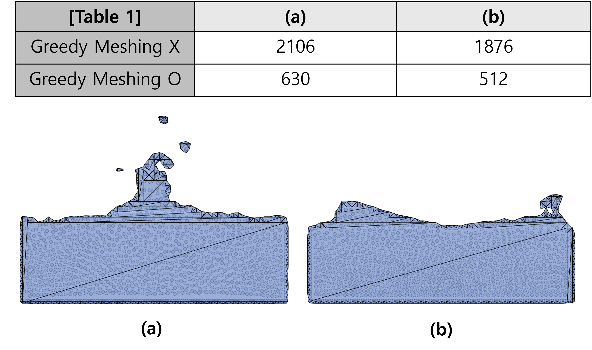

# Particle-based EMC Visualization Framework

[](https://p5js.org/)
[](https://developer.mozilla.org/en-US/docs/Web/JavaScript)

> An interactive web-based framework for visualizing a novel surface reconstruction algorithm from particle data using P5.js.

This project implements and visualizes an optimized **Extended Marching Cubes (EMC)** algorithm designed to overcome the limitations of the standard Marching Cubes (MC) method. By combining **Virtual Plane Projection** for accuracy and **Greedy Meshing** for performance, this framework provides a robust solution for generating high-fidelity surfaces from dynamic particle datasets, such as those from fluid simulations.

**[Live Demo](https://ybg1219.github.io/PartiEMC/)**

### Framework Demo

[**>> Click here to watch the demo video (데모 영상 보기) <<**](readme_assset/demo.mp4)


---

### Table of Contents
1. [**Background**](#1-background)
2. [**Core Algorithms**](#2-core-algorithms)
3. [**Pipeline**](#3-pipeline)
4. [**Key Features**](#4-key-features)
5. [**Tech Stack**](#5-tech-stack)
6. [**Usage**](#6-usage)
7. [**File Structure**](#7-file-structure)

---

### 1. Background

The standard Marching Cubes (MC) algorithm is a widely used method for extracting a mesh from a scalar field. However, it suffers from two major drawbacks:
* **Volume Loss**: It often fails to accurately represent surfaces, leading to a loss of volume.
* **Poor Feature Preservation**: It struggles to reconstruct sharp features like corners and edges, resulting in overly smooth or ambiguous geometry.

This project addresses these issues by implementing an enhanced EMC algorithm specifically tailored for particle-based data, which is common in physics simulations but lacks the explicit connectivity needed for traditional methods.


*<p align="center">Fig. 5: 제안 기법과 기존 Marching Cubes(MC)의 표면 복원 결과 비교: (좌) MC의 볼륨 손실, (우) 제안 기법의 형상 보존</p>*


### 2. Core Algorithms

This framework is built upon two key technical contributions to solve the challenges of particle-based surface reconstruction:

#### Virtual Plane Projection
To overcome the problem of inaccurate normal vectors in sparse particle data, this method calculates a stable normal from the average position of particles within a grid cell. This normal defines a "virtual plane," and the particle furthest from this plane is chosen as the new, feature-preserving vertex for the EMC algorithm.


*<p align="center">Fig. 4: 가상 평면 투영(Virtual Plane Projection)을 이용한 법선 벡터 추정 과정</p>*

#### Greedy Meshing
To enable real-time performance, the framework incorporates a Greedy Meshing optimization step. After the initial surface is generated, this algorithm scans the mesh and merges unnecessary internal triangles into larger polygons. This significantly reduces the total triangle count (by up to 75%) without sacrificing any detail on the visible outer surface, dramatically lowering the rendering and memory load.


*<p align="center">Fig. 10: 다양한 프레임에서의 유체 시뮬레이션 표면 복원 결과 및 삼각형 개수</p>*


### 3. Pipeline

The framework processes data through the pipeline illustrated in Fig. 1. It begins with particle data input and proceeds through several stages of calculation and optimization before rendering the final surface.


*<p align="center">Fig. 1: 제안하는 입자 기반 EMC 프레임워크의 소프트웨어 아키텍처</p>*

1.  **Data Input**: Loads particle data from `.txt` files (Fluid Data Mode) or generates it procedurally (SPH and SDF Modes).
2.  **Scalar Field Construction**: Converts the discrete particle distribution into a continuous scalar field using SPH (Smoothed Particle Hydrodynamics) kernels.
3.  **Surface Reconstruction**: Extracts the isosurface using the enhanced EMC algorithm with Virtual Plane Projection.
4.  **Mesh Optimization**: Simplifies the internal mesh structure using Greedy Meshing.
5.  **Interactive Visualization**: Renders the final mesh and provides a rich UI for real-time interaction and debugging.

### 4. Key Features

* **Multi-Mode Operation**
    * **Fluid Data Mode**: Animates pre-computed fluid simulation data with full playback controls.
    * **SPH Mode**: Generates and simulates particles in real-time based on SPH principles.
    * **SDF Mode**: Creates surfaces from mathematical Signed Distance Functions (circle, square) to validate algorithm accuracy.

* **Comprehensive UI Controls**
    * **Animation**: Play, pause, frame-by-frame scrubbing, and speed adjustment.
    * **Algorithm Toggles**: Independently enable or disable MC, EMC, and Greedy Meshing to compare results.
    * **Debug Views**: Toggle the visibility of the grid, particles, field values, normal vectors, and influence radii (`R` and `r`) to inspect the algorithm at every stage.

* **Real-time Visual Feedback**
    * On-canvas guides for abstract parameters, such as the SDF radius and SPH influence zones.
    * Live display of statistics, including frame count and the number of generated triangles.

### 5. Tech Stack

* **Language**: JavaScript (ES6+)
* **Core Library**: [**P5.js**](https://p5js.org/) for rendering and interaction.
* **UI Library**: [**p5.dom.js**](https://p5js.org/reference/#/libraries/p5.dom) for creating sliders, buttons, and checkboxes.
* **Development Environment**: Visual Studio Code with the Live Server extension.

### 6. Usage

#### Requirements
* A modern web browser (e.g., Chrome, Firefox).
* For local development: [Visual Studio Code](https://code.visualstudio.com/) and the [Live Server](https://marketplace.visualstudio.com/items?itemName=ritwickdey.LiveServer) extension.

#### Running the Application
1.  Clone this repository to your local machine.
2.  Open the project folder in Visual Studio Code.
3.  Right-click the `index.html` file and select **`Open with Live Server`**.

#### Data Format
* Particle data for the Fluid Data Mode must be placed inside the `/data` folder.
* Files should be named sequentially (`0.txt`, `1.txt`, etc.).
* Each line in a file represents a single particle's 2D coordinate, with values separated by a space.
```
0.512 0.489
0.530 0.477
...
```

### 7. File Structure
```
.
├── 📁 data/             # Particle data (.txt) files
├── 📄 index.html        # Main HTML entry point, loads all scripts
├── 📄 sketch.js         # Main logic, global variables, and p5.js functions
├── 📄 particle.js        # Particle class definition
├── 📄 grid.js            # Grid class definition
├── 📄 mc.js              # Marching Cubes (MC) class and lookup tables
├── 📄 emc.js             # Extended Marching Cubes (EMC) class
├── 📄 p5.js              # p5.js core library
└── 📄 p5.dom.min.js      # p5.dom library for UI
```